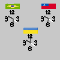
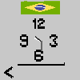

# 💻 Computação Gráfica
- Caio de Freitas Oliveira - 501375
- Matheus Ribeiro Alencar - 494711

## Sobre o programa
Nosso programa consiste em 3 relógios de ponteiros que marcam a hora oficial em tempo real de três países (Brasil, Taiwan e Ucrânia).

Para que as horas sejam exibidas corretamente, é necessário que a máquina esteja no fuso horário do Brasil (GMT -3).

## Como funciona
O trabalho foi desenvolvido em **JavaScript** utilizando a biblioteca **P5.js**.
Para executá-lo, é necessário servir o diretório atual em um servidor local e abrir o arquivo `index.html`.

Como o canva possui uma dimensão pequena (100 x 100), sugerimos que aumente o zoom da página.

### Alternativa
Como alternativa para o servidor local, recomendamos o [Simple Server do Python](https://www.digitalocean.com/community/tutorials/python-simplehttpserver-http-server).